# Weather Prediction for Pedestrain Safety

## Introduction

# write stuff about why we picked this

## Data Collection

We gathered our data from https://www.kaggle.com/datasets/grubenm/austin-weather. The weather data is a subset of the overall Austin Bike Shares Trip mobile app database https://www.kaggle.com/datasets/jboysen/austin-bike. The data is provided as a CSV file, so we downloaded the file and worked with it locally. 


```python
import pandas as pd
import numpy as np
import matplotlib.pyplot as plt
import random
from datetime import datetime

%matplotlib inline
import pandas as pd
import numpy as np
import matplotlib as mpl
import matplotlib.pyplot as plt
import seaborn as sns
import statsmodels.api as sm
from statsmodels.formula.api import ols
from sklearn.feature_selection import f_regression
from sklearn.model_selection import train_test_split
from sklearn.linear_model import LinearRegression
from sklearn import linear_model
from sklearn import svm
from sklearn.datasets import make_classification
from sklearn.model_selection import KFold
from sklearn.model_selection import cross_val_score
from sklearn.model_selection import RepeatedKFold

```


```python
austin_weather = pd.read_csv("austin_weather.csv")
austin_weather.head()
```


<div>
<style scoped>
    .dataframe tbody tr th:only-of-type {
        vertical-align: middle;
    }

    .dataframe tbody tr th {
        vertical-align: top;
    }

    .dataframe thead th {
        text-align: right;
    }
</style>
<table border="1" class="dataframe">
  <thead>
    <tr style="text-align: right;">
      <th></th>
      <th>Date</th>
      <th>TempHighF</th>
      <th>TempAvgF</th>
      <th>TempLowF</th>
      <th>DewPointHighF</th>
      <th>DewPointAvgF</th>
      <th>DewPointLowF</th>
      <th>HumidityHighPercent</th>
      <th>HumidityAvgPercent</th>
      <th>HumidityLowPercent</th>
      <th>...</th>
      <th>SeaLevelPressureAvgInches</th>
      <th>SeaLevelPressureLowInches</th>
      <th>VisibilityHighMiles</th>
      <th>VisibilityAvgMiles</th>
      <th>VisibilityLowMiles</th>
      <th>WindHighMPH</th>
      <th>WindAvgMPH</th>
      <th>WindGustMPH</th>
      <th>PrecipitationSumInches</th>
      <th>Events</th>
    </tr>
  </thead>
  <tbody>
    <tr>
      <th>0</th>
      <td>2013-12-21</td>
      <td>74</td>
      <td>60</td>
      <td>45</td>
      <td>67</td>
      <td>49</td>
      <td>43</td>
      <td>93</td>
      <td>75</td>
      <td>57</td>
      <td>...</td>
      <td>29.68</td>
      <td>29.59</td>
      <td>10</td>
      <td>7</td>
      <td>2</td>
      <td>20</td>
      <td>4</td>
      <td>31</td>
      <td>0.46</td>
      <td>Rain , Thunderstorm</td>
    </tr>
    <tr>
      <th>1</th>
      <td>2013-12-22</td>
      <td>56</td>
      <td>48</td>
      <td>39</td>
      <td>43</td>
      <td>36</td>
      <td>28</td>
      <td>93</td>
      <td>68</td>
      <td>43</td>
      <td>...</td>
      <td>30.13</td>
      <td>29.87</td>
      <td>10</td>
      <td>10</td>
      <td>5</td>
      <td>16</td>
      <td>6</td>
      <td>25</td>
      <td>0</td>
      <td></td>
    </tr>
    <tr>
      <th>2</th>
      <td>2013-12-23</td>
      <td>58</td>
      <td>45</td>
      <td>32</td>
      <td>31</td>
      <td>27</td>
      <td>23</td>
      <td>76</td>
      <td>52</td>
      <td>27</td>
      <td>...</td>
      <td>30.49</td>
      <td>30.41</td>
      <td>10</td>
      <td>10</td>
      <td>10</td>
      <td>8</td>
      <td>3</td>
      <td>12</td>
      <td>0</td>
      <td></td>
    </tr>
    <tr>
      <th>3</th>
      <td>2013-12-24</td>
      <td>61</td>
      <td>46</td>
      <td>31</td>
      <td>36</td>
      <td>28</td>
      <td>21</td>
      <td>89</td>
      <td>56</td>
      <td>22</td>
      <td>...</td>
      <td>30.45</td>
      <td>30.3</td>
      <td>10</td>
      <td>10</td>
      <td>7</td>
      <td>12</td>
      <td>4</td>
      <td>20</td>
      <td>0</td>
      <td></td>
    </tr>
    <tr>
      <th>4</th>
      <td>2013-12-25</td>
      <td>58</td>
      <td>50</td>
      <td>41</td>
      <td>44</td>
      <td>40</td>
      <td>36</td>
      <td>86</td>
      <td>71</td>
      <td>56</td>
      <td>...</td>
      <td>30.33</td>
      <td>30.27</td>
      <td>10</td>
      <td>10</td>
      <td>7</td>
      <td>10</td>
      <td>2</td>
      <td>16</td>
      <td>T</td>
      <td></td>
    </tr>
  </tbody>
</table>
<p>5 rows × 21 columns</p>
</div>


## Data Management
We needed to modify the full dataset in order to manipulate it and use as many days of data as possible. Firstly, we needed to make sure that all the days had a weather event listed. The original dataset listed each sunny day with no value for the Events column. We replaced these blank values with "Sun". Additionally, in the precipitation category, all values of 'T' represented 'Trace', which is an amount of precipitation measuring less than 0.01 inch. We replaced all 'T' values with 0.01 in order to perform numerical analyses. We also converted the date values given in string format into panda's datetimes objects for better ease of sorting later on.


```python
#Converting string dates into datetime.date objects
for i, currRow in austin_weather.iterrows():
    austin_weather.at[i, 'Date'] = datetime.strptime(austin_weather.at[i, 'Date'], "%Y-%m-%d").date()

austin_weather['Events'].replace(' ', 'Sun', inplace=True)
austin_weather['PrecipitationSumInches'].replace('T', 0.01, inplace=True)
austin_weather.head()
```


<div>
<style scoped>
    .dataframe tbody tr th:only-of-type {
        vertical-align: middle;
    }

    .dataframe tbody tr th {
        vertical-align: top;
    }

    .dataframe thead th {
        text-align: right;
    }
</style>
<table border="1" class="dataframe">
  <thead>
    <tr style="text-align: right;">
      <th></th>
      <th>Date</th>
      <th>TempHighF</th>
      <th>TempAvgF</th>
      <th>TempLowF</th>
      <th>DewPointHighF</th>
      <th>DewPointAvgF</th>
      <th>DewPointLowF</th>
      <th>HumidityHighPercent</th>
      <th>HumidityAvgPercent</th>
      <th>HumidityLowPercent</th>
      <th>...</th>
      <th>SeaLevelPressureAvgInches</th>
      <th>SeaLevelPressureLowInches</th>
      <th>VisibilityHighMiles</th>
      <th>VisibilityAvgMiles</th>
      <th>VisibilityLowMiles</th>
      <th>WindHighMPH</th>
      <th>WindAvgMPH</th>
      <th>WindGustMPH</th>
      <th>PrecipitationSumInches</th>
      <th>Events</th>
    </tr>
  </thead>
  <tbody>
    <tr>
      <th>0</th>
      <td>2013-12-21</td>
      <td>74</td>
      <td>60</td>
      <td>45</td>
      <td>67</td>
      <td>49</td>
      <td>43</td>
      <td>93</td>
      <td>75</td>
      <td>57</td>
      <td>...</td>
      <td>29.68</td>
      <td>29.59</td>
      <td>10</td>
      <td>7</td>
      <td>2</td>
      <td>20</td>
      <td>4</td>
      <td>31</td>
      <td>0.46</td>
      <td>Rain , Thunderstorm</td>
    </tr>
    <tr>
      <th>1</th>
      <td>2013-12-22</td>
      <td>56</td>
      <td>48</td>
      <td>39</td>
      <td>43</td>
      <td>36</td>
      <td>28</td>
      <td>93</td>
      <td>68</td>
      <td>43</td>
      <td>...</td>
      <td>30.13</td>
      <td>29.87</td>
      <td>10</td>
      <td>10</td>
      <td>5</td>
      <td>16</td>
      <td>6</td>
      <td>25</td>
      <td>0</td>
      <td>Sun</td>
    </tr>
    <tr>
      <th>2</th>
      <td>2013-12-23</td>
      <td>58</td>
      <td>45</td>
      <td>32</td>
      <td>31</td>
      <td>27</td>
      <td>23</td>
      <td>76</td>
      <td>52</td>
      <td>27</td>
      <td>...</td>
      <td>30.49</td>
      <td>30.41</td>
      <td>10</td>
      <td>10</td>
      <td>10</td>
      <td>8</td>
      <td>3</td>
      <td>12</td>
      <td>0</td>
      <td>Sun</td>
    </tr>
    <tr>
      <th>3</th>
      <td>2013-12-24</td>
      <td>61</td>
      <td>46</td>
      <td>31</td>
      <td>36</td>
      <td>28</td>
      <td>21</td>
      <td>89</td>
      <td>56</td>
      <td>22</td>
      <td>...</td>
      <td>30.45</td>
      <td>30.3</td>
      <td>10</td>
      <td>10</td>
      <td>7</td>
      <td>12</td>
      <td>4</td>
      <td>20</td>
      <td>0</td>
      <td>Sun</td>
    </tr>
    <tr>
      <th>4</th>
      <td>2013-12-25</td>
      <td>58</td>
      <td>50</td>
      <td>41</td>
      <td>44</td>
      <td>40</td>
      <td>36</td>
      <td>86</td>
      <td>71</td>
      <td>56</td>
      <td>...</td>
      <td>30.33</td>
      <td>30.27</td>
      <td>10</td>
      <td>10</td>
      <td>7</td>
      <td>10</td>
      <td>2</td>
      <td>16</td>
      <td>0.01</td>
      <td>Sun</td>
    </tr>
  </tbody>
</table>
<p>5 rows × 21 columns</p>
</div>


This dataset displayed missing data as '-' and has a total of 80 missing data points across all columns. As this data is negligible in consideration to the dataset of over 1300 values, we have decided to remove all rows with data points that have missing values.


```python
austin_weather = austin_weather.replace('-', np.NaN, regex=True)
austin_weather = austin_weather.dropna()
```

To be able to numerically handle all of the data, we will convert all the variables other than the weather event type to floats from strings.


```python
austin_weather['TempHighF'] = austin_weather['TempHighF'].astype(float)
austin_weather['TempAvgF'] = austin_weather['TempAvgF'].astype(float)
austin_weather['TempLowF'] = austin_weather['TempLowF'].astype(float)
austin_weather['DewPointHighF'] = austin_weather['DewPointHighF'].astype(float)
austin_weather['DewPointAvgF'] = austin_weather['DewPointAvgF'].astype(float)
austin_weather['DewPointLowF'] = austin_weather['DewPointLowF'].astype(float)
austin_weather['HumidityHighPercent'] = austin_weather['HumidityHighPercent'].astype(float)
austin_weather['HumidityAvgPercent'] = austin_weather['HumidityAvgPercent'].astype(float)
austin_weather['HumidityLowPercent'] = austin_weather['HumidityLowPercent'].astype(float)
austin_weather['SeaLevelPressureHighInches'] = austin_weather['SeaLevelPressureHighInches'].astype(float)
austin_weather['SeaLevelPressureAvgInches'] = austin_weather['SeaLevelPressureAvgInches'].astype(float)
austin_weather['SeaLevelPressureLowInches'] = austin_weather['SeaLevelPressureLowInches'].astype(float)
austin_weather['VisibilityHighMiles'] = austin_weather['VisibilityHighMiles'].astype(float)
austin_weather['VisibilityAvgMiles'] = austin_weather['VisibilityAvgMiles'].astype(float)
austin_weather['VisibilityLowMiles'] = austin_weather['VisibilityLowMiles'].astype(float)
austin_weather['WindHighMPH'] = austin_weather['WindHighMPH'].astype(float)
austin_weather['WindAvgMPH'] = austin_weather['WindAvgMPH'].astype(float)
austin_weather['WindGustMPH'] = austin_weather['WindGustMPH'].astype(float)
austin_weather['PrecipitationSumInches'] = austin_weather['PrecipitationSumInches'].astype(float)
austin_weather.head()
```


<div>
<style scoped>
    .dataframe tbody tr th:only-of-type {
        vertical-align: middle;
    }

    .dataframe tbody tr th {
        vertical-align: top;
    }

    .dataframe thead th {
        text-align: right;
    }
</style>
<table border="1" class="dataframe">
  <thead>
    <tr style="text-align: right;">
      <th></th>
      <th>Date</th>
      <th>TempHighF</th>
      <th>TempAvgF</th>
      <th>TempLowF</th>
      <th>DewPointHighF</th>
      <th>DewPointAvgF</th>
      <th>DewPointLowF</th>
      <th>HumidityHighPercent</th>
      <th>HumidityAvgPercent</th>
      <th>HumidityLowPercent</th>
      <th>...</th>
      <th>SeaLevelPressureAvgInches</th>
      <th>SeaLevelPressureLowInches</th>
      <th>VisibilityHighMiles</th>
      <th>VisibilityAvgMiles</th>
      <th>VisibilityLowMiles</th>
      <th>WindHighMPH</th>
      <th>WindAvgMPH</th>
      <th>WindGustMPH</th>
      <th>PrecipitationSumInches</th>
      <th>Events</th>
    </tr>
  </thead>
  <tbody>
    <tr>
      <th>0</th>
      <td>2013-12-21</td>
      <td>74.0</td>
      <td>60.0</td>
      <td>45.0</td>
      <td>67.0</td>
      <td>49.0</td>
      <td>43.0</td>
      <td>93.0</td>
      <td>75.0</td>
      <td>57.0</td>
      <td>...</td>
      <td>29.68</td>
      <td>29.59</td>
      <td>10.0</td>
      <td>7.0</td>
      <td>2.0</td>
      <td>20.0</td>
      <td>4.0</td>
      <td>31.0</td>
      <td>0.46</td>
      <td>Rain , Thunderstorm</td>
    </tr>
    <tr>
      <th>1</th>
      <td>2013-12-22</td>
      <td>56.0</td>
      <td>48.0</td>
      <td>39.0</td>
      <td>43.0</td>
      <td>36.0</td>
      <td>28.0</td>
      <td>93.0</td>
      <td>68.0</td>
      <td>43.0</td>
      <td>...</td>
      <td>30.13</td>
      <td>29.87</td>
      <td>10.0</td>
      <td>10.0</td>
      <td>5.0</td>
      <td>16.0</td>
      <td>6.0</td>
      <td>25.0</td>
      <td>0.00</td>
      <td>Sun</td>
    </tr>
    <tr>
      <th>2</th>
      <td>2013-12-23</td>
      <td>58.0</td>
      <td>45.0</td>
      <td>32.0</td>
      <td>31.0</td>
      <td>27.0</td>
      <td>23.0</td>
      <td>76.0</td>
      <td>52.0</td>
      <td>27.0</td>
      <td>...</td>
      <td>30.49</td>
      <td>30.41</td>
      <td>10.0</td>
      <td>10.0</td>
      <td>10.0</td>
      <td>8.0</td>
      <td>3.0</td>
      <td>12.0</td>
      <td>0.00</td>
      <td>Sun</td>
    </tr>
    <tr>
      <th>3</th>
      <td>2013-12-24</td>
      <td>61.0</td>
      <td>46.0</td>
      <td>31.0</td>
      <td>36.0</td>
      <td>28.0</td>
      <td>21.0</td>
      <td>89.0</td>
      <td>56.0</td>
      <td>22.0</td>
      <td>...</td>
      <td>30.45</td>
      <td>30.30</td>
      <td>10.0</td>
      <td>10.0</td>
      <td>7.0</td>
      <td>12.0</td>
      <td>4.0</td>
      <td>20.0</td>
      <td>0.00</td>
      <td>Sun</td>
    </tr>
    <tr>
      <th>4</th>
      <td>2013-12-25</td>
      <td>58.0</td>
      <td>50.0</td>
      <td>41.0</td>
      <td>44.0</td>
      <td>40.0</td>
      <td>36.0</td>
      <td>86.0</td>
      <td>71.0</td>
      <td>56.0</td>
      <td>...</td>
      <td>30.33</td>
      <td>30.27</td>
      <td>10.0</td>
      <td>10.0</td>
      <td>7.0</td>
      <td>10.0</td>
      <td>2.0</td>
      <td>16.0</td>
      <td>0.01</td>
      <td>Sun</td>
    </tr>
  </tbody>
</table>
<p>5 rows × 21 columns</p>
</div>


We will also create separate dataframes based on the weather event of each day.


```python
#create new dataframe based on Events column, that contain at least "Rain" event, and new dataframe that contains "Sun" event
austin_rain = austin_weather.loc[austin_weather['Events'].astype(str).str.contains('Rain')].copy()
austin_sun = austin_weather.loc[austin_weather['Events'].astype(str).str.contains('Sun')].copy()
austin_snow = austin_weather.loc[austin_weather['Events'].astype(str).str.contains('Snow')].copy()
austin_fog = austin_weather.loc[austin_weather['Events'].astype(str).str.contains('Fog')].copy()
austin_thunderstorm = austin_weather.loc[austin_weather['Events'].astype(str).str.contains('Thunderstorm')].copy()

#example of new dataframe that is only for rainy days
austin_rain.head()
```


<div>
<style scoped>
    .dataframe tbody tr th:only-of-type {
        vertical-align: middle;
    }

    .dataframe tbody tr th {
        vertical-align: top;
    }

    .dataframe thead th {
        text-align: right;
    }
</style>
<table border="1" class="dataframe">
  <thead>
    <tr style="text-align: right;">
      <th></th>
      <th>Date</th>
      <th>TempHighF</th>
      <th>TempAvgF</th>
      <th>TempLowF</th>
      <th>DewPointHighF</th>
      <th>DewPointAvgF</th>
      <th>DewPointLowF</th>
      <th>HumidityHighPercent</th>
      <th>HumidityAvgPercent</th>
      <th>HumidityLowPercent</th>
      <th>...</th>
      <th>SeaLevelPressureAvgInches</th>
      <th>SeaLevelPressureLowInches</th>
      <th>VisibilityHighMiles</th>
      <th>VisibilityAvgMiles</th>
      <th>VisibilityLowMiles</th>
      <th>WindHighMPH</th>
      <th>WindAvgMPH</th>
      <th>WindGustMPH</th>
      <th>PrecipitationSumInches</th>
      <th>Events</th>
    </tr>
  </thead>
  <tbody>
    <tr>
      <th>0</th>
      <td>2013-12-21</td>
      <td>74.0</td>
      <td>60.0</td>
      <td>45.0</td>
      <td>67.0</td>
      <td>49.0</td>
      <td>43.0</td>
      <td>93.0</td>
      <td>75.0</td>
      <td>57.0</td>
      <td>...</td>
      <td>29.68</td>
      <td>29.59</td>
      <td>10.0</td>
      <td>7.0</td>
      <td>2.0</td>
      <td>20.0</td>
      <td>4.0</td>
      <td>31.0</td>
      <td>0.46</td>
      <td>Rain , Thunderstorm</td>
    </tr>
    <tr>
      <th>18</th>
      <td>2014-01-08</td>
      <td>53.0</td>
      <td>47.0</td>
      <td>40.0</td>
      <td>51.0</td>
      <td>45.0</td>
      <td>30.0</td>
      <td>93.0</td>
      <td>75.0</td>
      <td>57.0</td>
      <td>...</td>
      <td>30.20</td>
      <td>30.12</td>
      <td>10.0</td>
      <td>2.0</td>
      <td>1.0</td>
      <td>12.0</td>
      <td>1.0</td>
      <td>18.0</td>
      <td>0.16</td>
      <td>Rain</td>
    </tr>
    <tr>
      <th>20</th>
      <td>2014-01-10</td>
      <td>72.0</td>
      <td>65.0</td>
      <td>57.0</td>
      <td>64.0</td>
      <td>61.0</td>
      <td>54.0</td>
      <td>93.0</td>
      <td>81.0</td>
      <td>68.0</td>
      <td>...</td>
      <td>29.87</td>
      <td>29.75</td>
      <td>10.0</td>
      <td>8.0</td>
      <td>1.0</td>
      <td>13.0</td>
      <td>6.0</td>
      <td>21.0</td>
      <td>0.10</td>
      <td>Rain</td>
    </tr>
    <tr>
      <th>22</th>
      <td>2014-01-12</td>
      <td>67.0</td>
      <td>57.0</td>
      <td>46.0</td>
      <td>58.0</td>
      <td>47.0</td>
      <td>33.0</td>
      <td>84.0</td>
      <td>68.0</td>
      <td>52.0</td>
      <td>...</td>
      <td>30.01</td>
      <td>29.90</td>
      <td>10.0</td>
      <td>10.0</td>
      <td>10.0</td>
      <td>15.0</td>
      <td>4.0</td>
      <td>24.0</td>
      <td>0.01</td>
      <td>Rain</td>
    </tr>
    <tr>
      <th>33</th>
      <td>2014-01-23</td>
      <td>56.0</td>
      <td>42.0</td>
      <td>27.0</td>
      <td>42.0</td>
      <td>29.0</td>
      <td>20.0</td>
      <td>78.0</td>
      <td>64.0</td>
      <td>50.0</td>
      <td>...</td>
      <td>30.47</td>
      <td>30.06</td>
      <td>10.0</td>
      <td>8.0</td>
      <td>2.0</td>
      <td>20.0</td>
      <td>9.0</td>
      <td>31.0</td>
      <td>0.06</td>
      <td>Rain , Snow</td>
    </tr>
  </tbody>
</table>
<p>5 rows × 21 columns</p>
</div>


## Exploratory Data Analysis
We will then try to create graphs to look at any important cycles that relate to time and the potential different variables that affect weather events.


```python
# Create x, y axis and title of graph
plt.figure(figsize = (14, 12))
plt.title("Dew Point over Time")
plt.xlabel("Date")
plt.ylabel("Dew Meters")
plt.plot(austin_weather['Date'], austin_weather['DewPointAvgF'])
plt.show()

# Create x, y axis and title of graph
plt.figure(figsize = (14, 12))
plt.title("Temperature over Time")
plt.xlabel("Date")
plt.ylabel("Temperature")
plt.plot(austin_weather['Date'], austin_weather['TempAvgF'])
plt.show()

# Create x, y axis and title of graph
plt.figure(figsize = (14, 12))
plt.title("Humidity over Time")
plt.xlabel("Date")
plt.ylabel("Humidity")
plt.plot(austin_weather['Date'], austin_weather['HumidityAvgPercent'])
plt.show()

# Create x, y axis and title of graph
plt.figure(figsize = (14, 12))
plt.title("Precipitation over Time")
plt.xlabel("Date")
plt.ylabel("Precipitation")
plt.plot(austin_weather['Date'], austin_weather['PrecipitationSumInches'])
plt.show()

# Create x, y axis and title of graph
plt.figure(figsize = (14, 12))
plt.title("Sea Level Pressure over Time")
plt.xlabel("Date")
plt.ylabel("Sea Level Pressure")
plt.plot(austin_weather['Date'], austin_weather['SeaLevelPressureAvgInches'])
plt.show()

# Create x, y axis and title of graph
plt.figure(figsize = (14, 12))
plt.title("Visibility over Time")
plt.xlabel("Date")
plt.ylabel("Visibility")
plt.plot(austin_weather['Date'], austin_weather['VisibilityAvgMiles'])
plt.show()

# Create x, y axis and title of graph
plt.figure(figsize = (14, 12))
plt.title("Wind MPH over Time")
plt.xlabel("Date")
plt.ylabel("Wind MPH")
plt.plot(austin_weather['Date'], austin_weather['WindAvgMPH'])
plt.show()
```


    
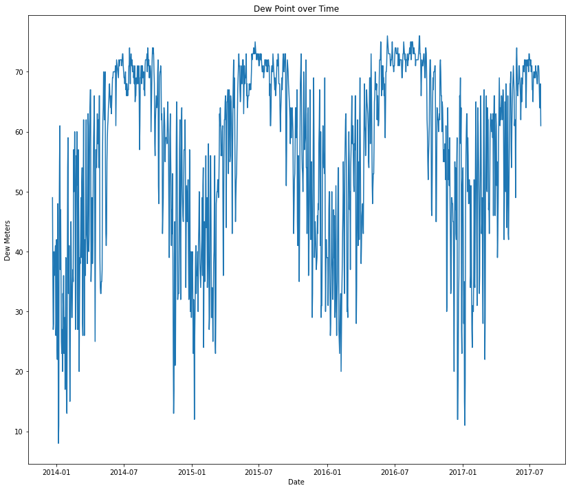
    


    
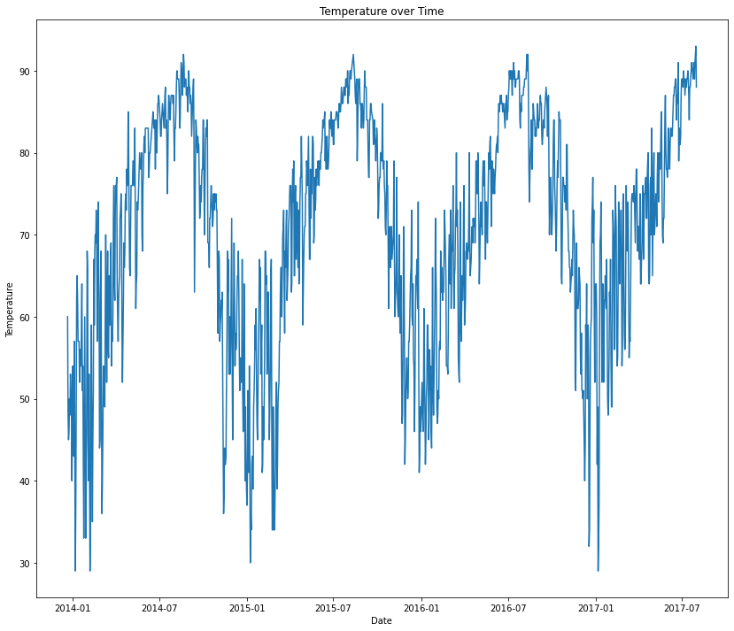
    


    
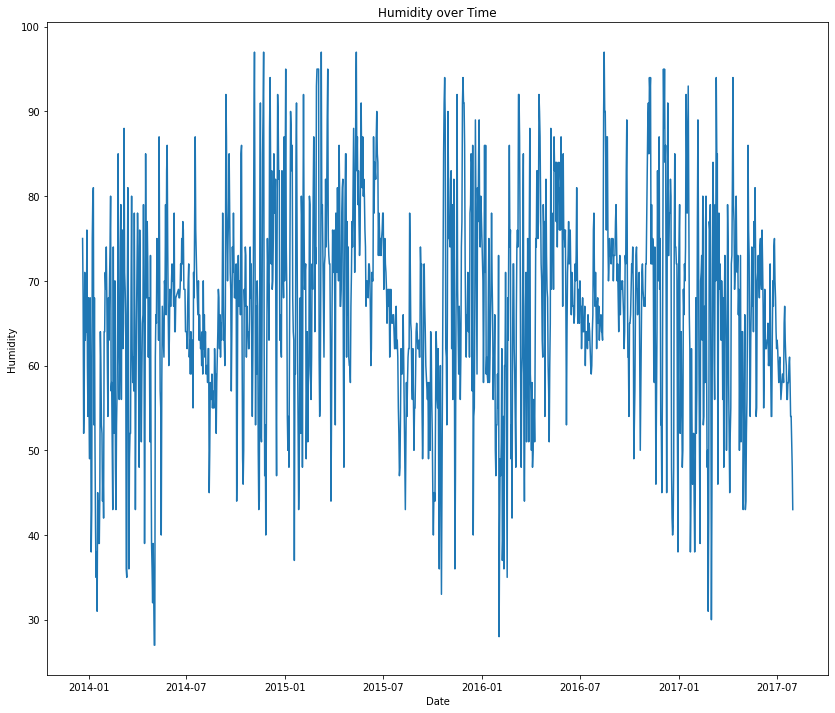
    


    
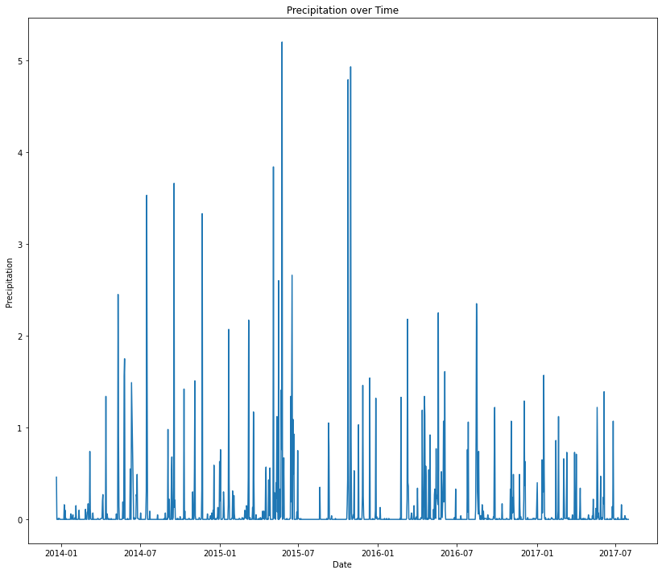
    


    
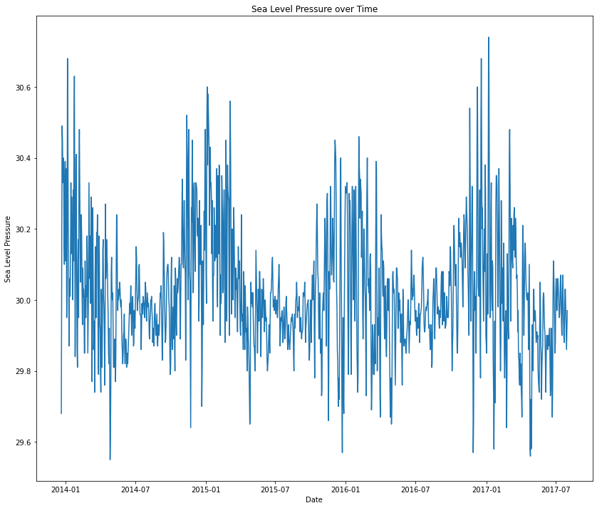
    


    
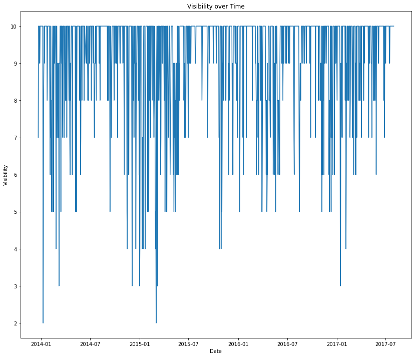
    


    
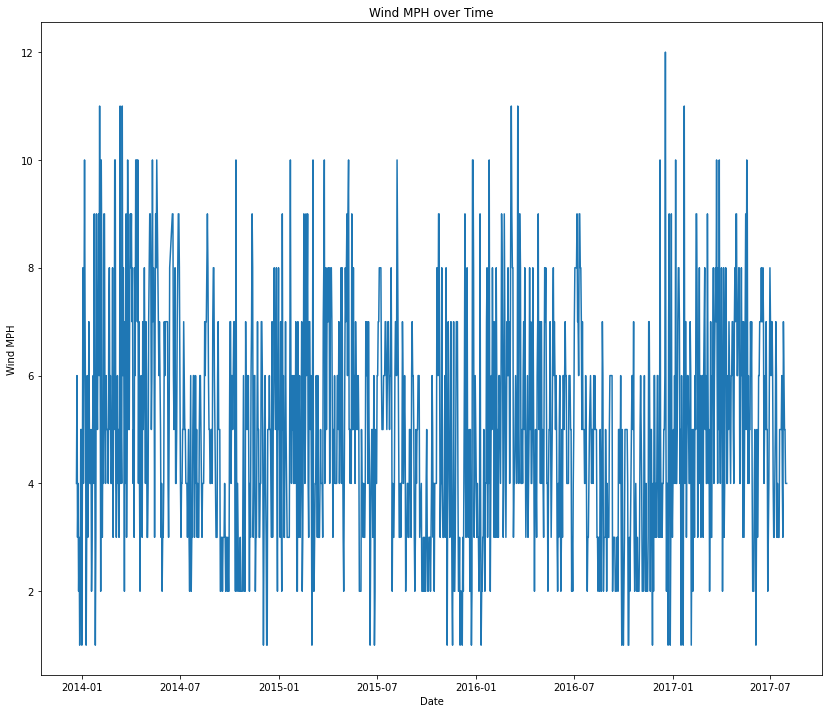
    


We will also make bar charts to the breakdown of weather events over each range of potential variables that affect the event outcomes.


```python
austin_weather1 = austin_weather[austin_weather['PrecipitationSumInches'] <= 1.0]
rain_1 = austin_weather1['Events'].str.contains('Rain').sum()
sun_1 = austin_weather1['Events'].str.contains('Sun').sum()
snow_1 = austin_weather1['Events'].str.contains('Snow').sum()
fog_1 = austin_weather_rain1['Events'].str.contains('Fog').sum()
thunderstorm_1 = austin_weather_rain1['Events'].str.contains('Thunderstorm').sum()

austin_weather2 = austin_weather[austin_weather['PrecipitationSumInches'] <= 2.0]
austin_weather2 = austin_weather2[austin_weather2['PrecipitationSumInches'] > 1.0]

rain_2 = austin_weather2['Events'].str.contains('Rain').sum()
sun_2 = austin_weather2['Events'].str.contains('Sun').sum()
snow_2 = austin_weather2['Events'].str.contains('Snow').sum()
fog_2 = austin_weather2['Events'].str.contains('Fog').sum()
thunderstorm_2 = austin_weather2['Events'].str.contains('Thunderstorm').sum()

austin_weather3 = austin_weather[austin_weather['PrecipitationSumInches'] <= 3.0]
austin_weather3 = austin_weather3[austin_weather3['PrecipitationSumInches'] > 2.0]

rain_3 = austin_weather3['Events'].str.contains('Rain').sum()
sun_3 = austin_weather3['Events'].str.contains('Sun').sum()
snow_3 = austin_weather3['Events'].str.contains('Snow').sum()
fog_3 = austin_weather3['Events'].str.contains('Fog').sum()
thunderstorm_3 = austin_weather3['Events'].str.contains('Thunderstorm').sum()


austin_weather4 = austin_weather[austin_weather['PrecipitationSumInches'] <= 4.0]
austin_weather4 = austin_weather4[austin_weather4['PrecipitationSumInches'] > 3.0]

rain_4 = austin_weather4['Events'].str.contains('Rain').sum()
sun_4 = austin_weather4['Events'].str.contains('Sun').sum()
snow_4 = austin_weather4['Events'].str.contains('Snow').sum()
fog_4 = austin_weather4['Events'].str.contains('Fog').sum()
thunderstorm_4 = austin_weather4['Events'].str.contains('Thunderstorm').sum()


austin_weather5 = austin_weather[austin_weather['PrecipitationSumInches'] <= 10.0]
austin_weather5 = austin_weather5[austin_weather5['PrecipitationSumInches'] > 4.0]

rain_5 = austin_weather5['Events'].str.contains('Rain').sum()
sun_5 = austin_weather5['Events'].str.contains('Sun').sum()
snow_5 = austin_weather5['Events'].str.contains('Snow').sum()
fog_5 = austin_weather5['Events'].str.contains('Fog').sum()
thunderstorm_5 = austin_weather5['Events'].str.contains('Thunderstorm').sum()

labels = ['Prec. <= 1 in', '1 in < Prec. <= 2 in', '2 in < Prec. <= 3 in', '3 in < Prec. <= 4 in', '4 in < Prec. <= 10 in']
rain_arr = [rain_1, rain_2, rain_3, rain_4, rain_5]
sun_arr = [sun_1, sun_2, sun_3, sun_4, sun_5]
snow_arr = [snow_1, snow_2, snow_3, snow_4, snow_5]
fog_arr = [fog_1, fog_2, fog_3, fog_4, fog_5]
thunderstorm_arr = [thunderstorm_1, thunderstorm_2, thunderstorm_3, thunderstorm_4, thunderstorm_5]


x = np.arange(len(labels))  # the label locations
width = 0.16  # the width of the bars

fig, ax = plt.subplots()

rects1 = ax.bar(x - (width*2), rain_arr, width, label='Rain')
rects2 = ax.bar(x - width, sun_arr, width, label='Sun')
rects3 = ax.bar(x , snow_arr, width, label='Snow')
rects4 = ax.bar(x + width, fog_arr, width, label='Fog')
rects5 = ax.bar(x + (width*2), thunderstorm_arr, width, label='Thunderstorm')

fig.set_size_inches(14, 12)

# Add some text for labels, title and custom x-axis tick labels, etc.
ax.set_ylabel('Occurences')
ax.set_title('Precipitation Levels of Different Events')
ax.set_xticks(x, labels)
ax.legend()

ax.bar_label(rects1, padding=4)
ax.bar_label(rects2, padding=4)
ax.bar_label(rects3, padding=4)
ax.bar_label(rects4, padding=4)
ax.bar_label(rects5, padding=4)


fig.tight_layout()

plt.show()
```


    
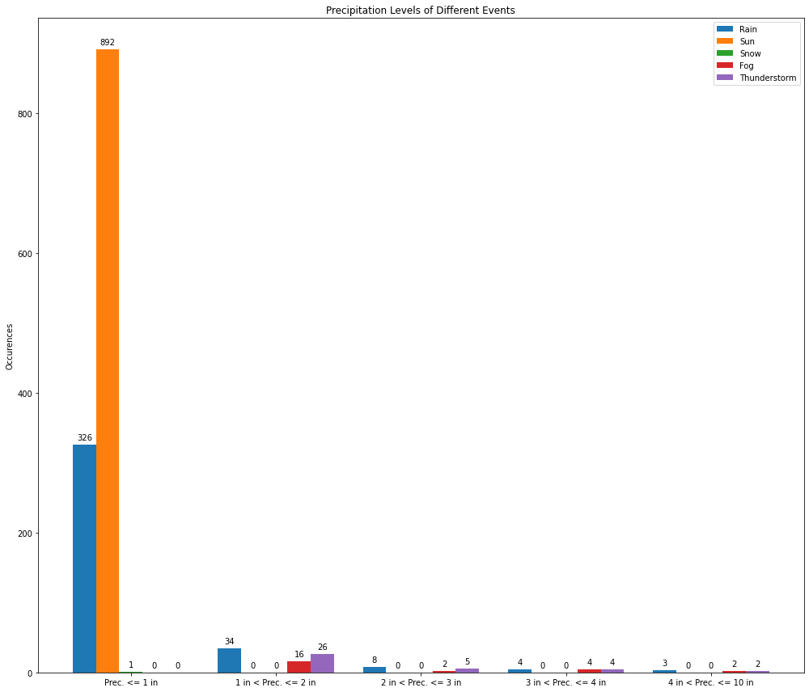
    


```python
austin_weather_dew1 = austin_weather[austin_weather['DewPointAvgF'] <= 20.0]
rain_1 = austin_weather_dew1['Events'].str.contains('Rain').sum()
sun_1 = austin_weather_dew1['Events'].str.contains('Sun').sum()
snow_1 = austin_weather_dew1['Events'].str.contains('Snow').sum()
fog_1 = austin_weather_dew1['Events'].str.contains('Fog').sum()
thunderstorm_1 = austin_weather_dew1['Events'].str.contains('Thunderstorm').sum()

austin_weather_dew2 = austin_weather[austin_weather['DewPointAvgF'] <= 40.0]
austin_weather_dew_2 = austin_weather_dew2[austin_weather_dew2['DewPointAvgF'] > 20.0]

rain_2 = austin_weather_dew_2['Events'].str.contains('Rain').sum()
sun_2 = austin_weather_dew_2['Events'].str.contains('Sun').sum()
snow_2 = austin_weather_dew_2['Events'].str.contains('Snow').sum()
fog_2 = austin_weather_dew_2['Events'].str.contains('Fog').sum()
thunderstorm_2 = austin_weather_dew_2['Events'].str.contains('Thunderstorm').sum()

austin_weather_dew3 = austin_weather[austin_weather['DewPointAvgF'] <= 60.0]
austin_weather_dew_3 = austin_weather_dew3[austin_weather_dew3['DewPointAvgF'] > 40.0]

rain_3 = austin_weather_dew_3['Events'].str.contains('Rain').sum()
sun_3 = austin_weather_dew_3['Events'].str.contains('Sun').sum()
snow_3 = austin_weather_dew_3['Events'].str.contains('Snow').sum()
fog_3 = austin_weather_dew_3['Events'].str.contains('Fog').sum()
thunderstorm_3 = austin_weather_dew_3['Events'].str.contains('Thunderstorm').sum()

austin_weather_dew4 = austin_weather[austin_weather['DewPointAvgF'] <= 80.0]
austin_weather_dew_4 = austin_weather_dew4[austin_weather_dew4['DewPointAvgF'] > 60.0]

rain_4 = austin_weather_dew_4['Events'].str.contains('Rain').sum()
sun_4 = austin_weather_dew_4['Events'].str.contains('Sun').sum()
snow_4 = austin_weather_dew_4['Events'].str.contains('Snow').sum()
fog_4 = austin_weather_dew_4['Events'].str.contains('Fog').sum()
thunderstorm_4 = austin_weather_dew_4['Events'].str.contains('Thunderstorm').sum()

austin_weather_dew5 = austin_weather[austin_weather['DewPointAvgF'] <= 100.0]
austin_weather_dew_5 = austin_weather_dew5[austin_weather_dew5['DewPointAvgF'] > 80.0]

rain_5 = austin_weather_dew_5['Events'].str.contains('Rain').sum()
sun_5 = austin_weather_dew_5['Events'].str.contains('Sun').sum()
snow_5 = austin_weather_dew_5['Events'].str.contains('Snow').sum()
fog_5 = austin_weather_dew_5['Events'].str.contains('Fog').sum()
thunderstorm_5 = austin_weather_dew_5['Events'].str.contains('Thunderstorm').sum()

labels = ['DewP <= 20 ', '20 < DewP <= 40 ', '40 < DewP <= 60 ', '60 < DewP <= 80 ', '80 < DewP <= 100 ']
rain_arr = [rain_1, rain_2, rain_3, rain_4, rain_5]
sun_arr = [sun_1, sun_2, sun_3, sun_4, sun_5]
snow_arr = [snow_1, snow_2, snow_3, snow_4, snow_5]
fog_arr = [fog_1, fog_2, fog_3, fog_4, fog_5]
thunderstorm_arr = [thunderstorm_1, thunderstorm_2, thunderstorm_3, thunderstorm_4, thunderstorm_5]

x = np.arange(len(labels))  # the label locations
width = 0.16  # the width of the bars

fig, ax = plt.subplots()

rects1 = ax.bar(x - (width*2), rain_arr, width, label='Rain')
rects2 = ax.bar(x - width, sun_arr, width, label='Sun')
rects3 = ax.bar(x , snow_arr, width, label='Snow')
rects4 = ax.bar(x + width, fog_arr, width, label='Fog')
rects5 = ax.bar(x + (width*2), thunderstorm_arr, width, label='Thunderstorm')

fig.set_size_inches(14, 12)

# Add some text for labels, title and custom x-axis tick labels, etc.
ax.set_ylabel('Occurences')
ax.set_title('Dew Point of Different Events')
ax.set_xticks(x, labels)
ax.legend()

ax.bar_label(rects1, padding=4)
ax.bar_label(rects2, padding=4)
ax.bar_label(rects3, padding=4)
ax.bar_label(rects4, padding=4)
ax.bar_label(rects5, padding=4)
fig.tight_layout()

plt.show()
```


    
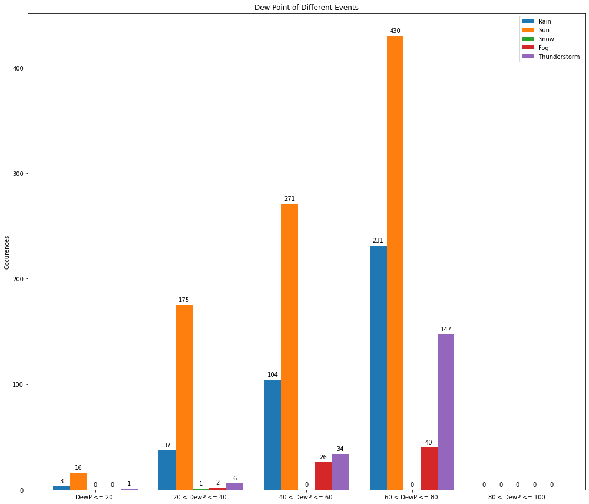
    


```python
austin_weather_humidity1 = austin_weather[austin_weather['HumidityAvgPercent'] <= 20.0]
rain_1 = austin_weather_humidity1['Events'].str.contains('Rain').sum()
sun_1 = austin_weather_humidity1['Events'].str.contains('Sun').sum()
snow_1 = austin_weather_humidity1['Events'].str.contains('Snow').sum()
fog_1 = austin_weather_humidity1['Events'].str.contains('Fog').sum()
thunderstorm_1 = austin_weather_humidity1['Events'].str.contains('Thunderstorm').sum()

austin_weather_humidity2 = austin_weather[austin_weather['HumidityAvgPercent'] <= 40.0]
austin_weather_humidity_2 = austin_weather_humidity2[austin_weather_humidity2['HumidityAvgPercent'] > 20.0]

rain_2 = austin_weather_humidity_2['Events'].str.contains('Rain').sum()
sun_2 = austin_weather_humidity_2['Events'].str.contains('Sun').sum()
snow_2 = austin_weather_humidity_2['Events'].str.contains('Snow').sum()
fog_2 = austin_weather_humidity_2['Events'].str.contains('Fog').sum()
thunderstorm_2 = austin_weather_humidity_2['Events'].str.contains('Thunderstorm').sum()

austin_weather_humidity3 = austin_weather[austin_weather['HumidityAvgPercent'] <= 60.0]
austin_weather_humidity_3 = austin_weather_humidity3[austin_weather_humidity3['HumidityAvgPercent'] > 40.0]

rain_3 = austin_weather_humidity_3['Events'].str.contains('Rain').sum()
sun_3 = austin_weather_humidity_3['Events'].str.contains('Sun').sum()
snow_3 = austin_weather_humidity_3['Events'].str.contains('Snow').sum()
fog_3 = austin_weather_humidity_3['Events'].str.contains('Fog').sum()
thunderstorm_3 = austin_weather_humidity_3['Events'].str.contains('Thunderstorm').sum()


austin_weather_humidity4 = austin_weather[austin_weather['HumidityAvgPercent'] <= 80.0]
austin_weather_humidity_4 = austin_weather_humidity4[austin_weather_humidity4['HumidityAvgPercent'] > 60.0]

rain_4 = austin_weather_humidity_4['Events'].str.contains('Rain').sum()
sun_4 = austin_weather_humidity_4['Events'].str.contains('Sun').sum()
snow_4 = austin_weather_humidity_4['Events'].str.contains('Snow').sum()
fog_4 = austin_weather_humidity_4['Events'].str.contains('Fog').sum()
thunderstorm_4 = austin_weather_humidity_4['Events'].str.contains('Thunderstorm').sum()


austin_weather_humidity5 = austin_weather[austin_weather['HumidityAvgPercent'] <= 100.0]
austin_weather_humidity_5 = austin_weather_humidity5[austin_weather_humidity5['HumidityAvgPercent'] > 80.0]

rain_5 = austin_weather_humidity_5['Events'].str.contains('Rain').sum()
sun_5 = austin_weather_humidity_5['Events'].str.contains('Sun').sum()
snow_5 = austin_weather_humidity_5['Events'].str.contains('Snow').sum()
fog_5 = austin_weather_humidity_5['Events'].str.contains('Fog').sum()
thunderstorm_5 = austin_weather_humidity_5['Events'].str.contains('Thunderstorm').sum()

labels = ['Humidity <= 20 ', '20 < Humidity <= 40 ', '40 < Humidity <= 60 ', '60 < Humidity <= 80 ', '80 < Humidity <= 100 ']
rain_arr = [rain_1, rain_2, rain_3, rain_4, rain_5]
sun_arr = [sun_1, sun_2, sun_3, sun_4, sun_5]
snow_arr = [snow_1, snow_2, snow_3, snow_4, snow_5]
fog_arr = [fog_1, fog_2, fog_3, fog_4, fog_5]
thunderstorm_arr = [thunderstorm_1, thunderstorm_2, thunderstorm_3, thunderstorm_4, thunderstorm_5]

x = np.arange(len(labels))  # the label locations
width = 0.16  # the width of the bars

fig, ax = plt.subplots()

rects1 = ax.bar(x - (width*2), rain_arr, width, label='Rain')
rects2 = ax.bar(x - width, sun_arr, width, label='Sun')
rects3 = ax.bar(x , snow_arr, width, label='Snow')
rects4 = ax.bar(x + width, fog_arr, width, label='Fog')
rects5 = ax.bar(x + (width*2), thunderstorm_arr, width, label='Thunderstorm')

fig.set_size_inches(14, 12)

# Add some text for labels, title and custom x-axis tick labels, etc.
ax.set_ylabel('Occurences')
ax.set_title('Avgerage Humidity Percent of Different Events')
ax.set_xticks(x, labels)
ax.legend()

ax.bar_label(rects1, padding=4)
ax.bar_label(rects2, padding=4)
ax.bar_label(rects3, padding=4)
ax.bar_label(rects4, padding=4)
ax.bar_label(rects5, padding=4)
fig.tight_layout()

plt.show()
```


    
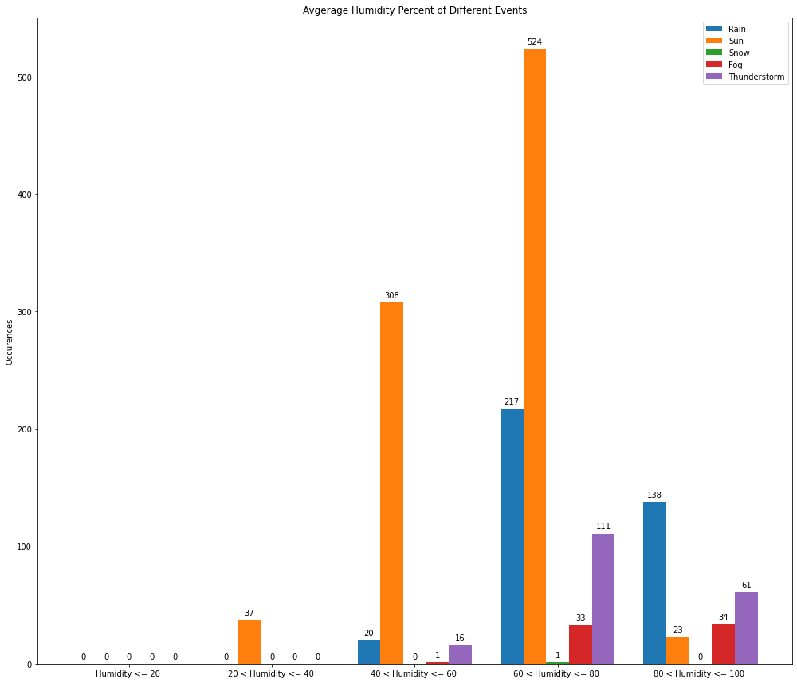
    


We would also like to explore the relationship between any two variables. Based on the plots we have created, we want to examine the relationships between the humidity, sea level, temperature, and dew point variables. These variables had relatively cyclic trends in the line graphs, and some of them had a good variation in the events they represented in the charts. For example, all of the weather events besides snow are visible on the chart for humidity. Since this is for exploratory purposes to determine what variables can predict all weather events later on, we will only be focusing on the rain and sun events which occur the most often within this dataset.


```python
austin_rain = austin_weather.loc[austin_weather['Events'].astype(str).str.contains('Rain')].copy()
fig, ax = plt.subplots()
ax.scatter(austin_rain['SeaLevelPressureAvgInches'], austin_rain['HumidityAvgPercent'], s=None, vmin=0, vmax=100)
ax.scatter(austin_sun['SeaLevelPressureAvgInches'], austin_sun['HumidityAvgPercent'], s=None, vmin=0, vmax=100)
ax.set(xlim=(26, 34), xticks=np.arange(26, 34),
       ylim=(20, 100), yticks=np.arange(20, 100))
ax.set_xlabel('Sea Level Pressure Avg Inches', fontsize=15)
ax.set_ylabel('Humidity Avg Percent', fontsize=15)
ax.set_title('Sea Level vs Humidity')
fig.set_size_inches(10, 15)

plt.show()
```


    
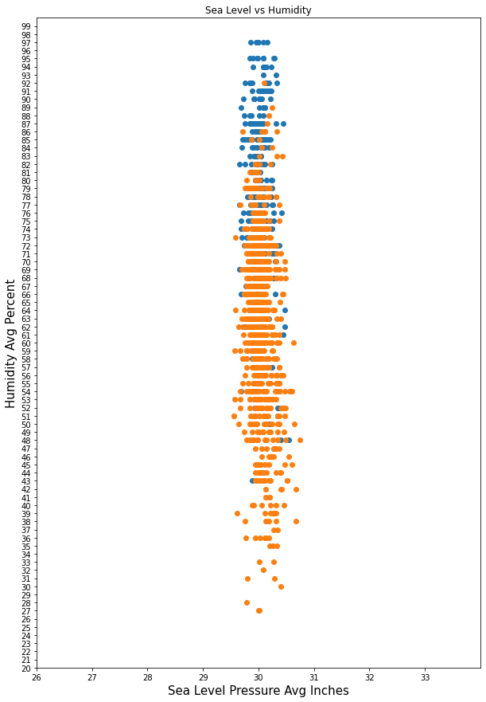
    


Here we can see that Sea Level Pressure is a negligible factor in between all 5 different events. While we can rule out Sea level Pressure as a contributing factor, rain seems to occur more often while there is higher humidity, so we will explore the relationship between the other variables and humidity further.


```python
austin_rain = austin_weather.loc[austin_weather['Events'].astype(str).str.contains('Rain')].copy()
fig, ax = plt.subplots()
ax.scatter(austin_rain['DewPointAvgF'], austin_rain['HumidityAvgPercent'], s=None, vmin=0, vmax=100)
ax.scatter(austin_sun['DewPointAvgF'], austin_sun['HumidityAvgPercent'], s=None, vmin=0, vmax=100)
ax.set(xlim=(0, 100), xticks=np.arange(0, 100),
       ylim=(20, 100), yticks=np.arange(20, 100))
ax.set_xlabel('DewPointAvgF', fontsize=15)
ax.set_ylabel('Humidity Avg Percent', fontsize=15)
ax.set_title('Dew Point vs Humidity')
fig.set_size_inches(20, 15)

plt.show()
```


    
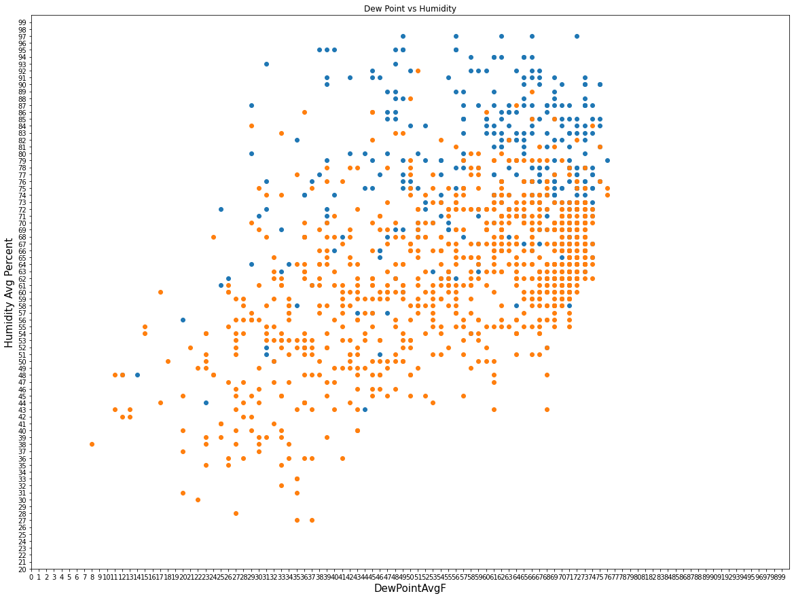
    


As we noticed before, with a high humidity the chances of rain increases while sun decreases. And as similarly with sea level pressure, we can see that dew point average does not have an affect on the probability of certain events occurring. Both low and high dew points lead to an equal amount of rain and sun events.


```python
austin_rain = austin_weather.loc[austin_weather['Events'].astype(str).str.contains('Rain')].copy()
fig, ax = plt.subplots()
ax.scatter(austin_rain['TempAvgF'], austin_rain['HumidityAvgPercent'], s=None, vmin=0, vmax=100)
ax.scatter(austin_sun['TempAvgF'], austin_sun['HumidityAvgPercent'], s=None, vmin=0, vmax=100)
ax.set(xlim=(0, 100), xticks=np.arange(0, 100),
       ylim=(20, 100), yticks=np.arange(20, 100))
ax.set_xlabel('TempAvgF', fontsize=15)
ax.set_ylabel('Humidity Avg Percent', fontsize=15)
ax.set_title('Temperature vs Humidity')
fig.set_size_inches(20, 15)

plt.show()
```


    
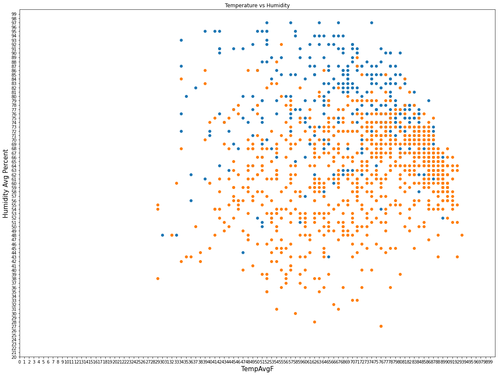
    


Temperature also does not seem to have an effect on the probability of events as low and high temperatures had an equal amount of both rain and sun events.


```python
austin_rain = austin_weather.loc[austin_weather['Events'].astype(str).str.contains('Rain')].copy()
fig, ax = plt.subplots()
ax.scatter(austin_rain['VisibilityAvgMiles'], austin_rain['HumidityAvgPercent'], s=None, vmin=0, vmax=100)
ax.scatter(austin_sun['VisibilityAvgMiles'], austin_sun['HumidityAvgPercent'], s=None, vmin=0, vmax=100)
ax.set(xlim=(0, 12), xticks=np.arange(0, 12),
       ylim=(20, 100), yticks=np.arange(20, 100))
ax.set_xlabel('VisibilityAvgMiles', fontsize=15)
ax.set_ylabel('Humidity Avg Percent', fontsize=15)
ax.set_title('Visibility vs Humidity')
fig.set_size_inches(10, 15)

plt.show()
```


    
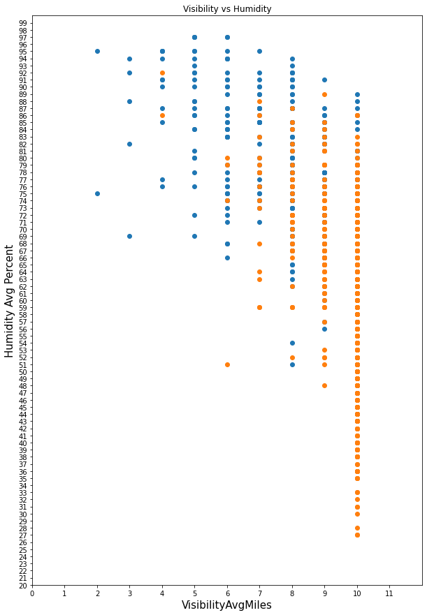
    


Here we can see that both humidity and visibility are contributing factors towards the event. With high humidity and low visibiilty we can see an increase in the event rain, and with low humidity and high visibility we can see a increase in the event sun.

## Hypothesis Testing and Classification Methods
We want to determine a good model that will determine what the weather event is based on variable information. Through our exploration of the past data, we have recognized that humidity and visibility may be good variables that can predict what the weather event will be. Since we will be using to data to determine a type of event, we need to use a classification method. For ease, we have chosen to try to determine a classification technique using linear SVM. However, we need to determine which variable will be more useful in giving an accurate classification. In order to determine this, we will be performing a paired t-test.

First, we need to create our models and determine how well they perform on testing and training data. We create split our Austin weather dataset into a training dataframe and a testing dataframe.


```python
train, test = train_test_split(austin_weather, test_size = 0.2, random_state = 42, shuffle=True)
train.head()
```


<div>
<style scoped>
    .dataframe tbody tr th:only-of-type {
        vertical-align: middle;
    }

    .dataframe tbody tr th {
        vertical-align: top;
    }

    .dataframe thead th {
        text-align: right;
    }
</style>
<table border="1" class="dataframe">
  <thead>
    <tr style="text-align: right;">
      <th></th>
      <th>Date</th>
      <th>TempHighF</th>
      <th>TempAvgF</th>
      <th>TempLowF</th>
      <th>DewPointHighF</th>
      <th>DewPointAvgF</th>
      <th>DewPointLowF</th>
      <th>HumidityHighPercent</th>
      <th>HumidityAvgPercent</th>
      <th>HumidityLowPercent</th>
      <th>...</th>
      <th>SeaLevelPressureAvgInches</th>
      <th>SeaLevelPressureLowInches</th>
      <th>VisibilityHighMiles</th>
      <th>VisibilityAvgMiles</th>
      <th>VisibilityLowMiles</th>
      <th>WindHighMPH</th>
      <th>WindAvgMPH</th>
      <th>WindGustMPH</th>
      <th>PrecipitationSumInches</th>
      <th>Events</th>
    </tr>
  </thead>
  <tbody>
    <tr>
      <th>994</th>
      <td>2016-09-10</td>
      <td>93.0</td>
      <td>82.0</td>
      <td>71.0</td>
      <td>75.0</td>
      <td>71.0</td>
      <td>64.0</td>
      <td>94.0</td>
      <td>68.0</td>
      <td>41.0</td>
      <td>...</td>
      <td>30.06</td>
      <td>29.94</td>
      <td>10.0</td>
      <td>9.0</td>
      <td>2.0</td>
      <td>18.0</td>
      <td>6.0</td>
      <td>31.0</td>
      <td>0.05</td>
      <td>Rain</td>
    </tr>
    <tr>
      <th>981</th>
      <td>2016-08-28</td>
      <td>92.0</td>
      <td>83.0</td>
      <td>73.0</td>
      <td>75.0</td>
      <td>72.0</td>
      <td>70.0</td>
      <td>91.0</td>
      <td>72.0</td>
      <td>52.0</td>
      <td>...</td>
      <td>29.98</td>
      <td>29.90</td>
      <td>10.0</td>
      <td>9.0</td>
      <td>1.0</td>
      <td>12.0</td>
      <td>3.0</td>
      <td>22.0</td>
      <td>0.16</td>
      <td>Rain</td>
    </tr>
    <tr>
      <th>10</th>
      <td>2013-12-31</td>
      <td>55.0</td>
      <td>46.0</td>
      <td>36.0</td>
      <td>31.0</td>
      <td>28.0</td>
      <td>23.0</td>
      <td>76.0</td>
      <td>54.0</td>
      <td>32.0</td>
      <td>...</td>
      <td>30.39</td>
      <td>30.27</td>
      <td>10.0</td>
      <td>10.0</td>
      <td>10.0</td>
      <td>8.0</td>
      <td>1.0</td>
      <td>12.0</td>
      <td>0.00</td>
      <td>Sun</td>
    </tr>
    <tr>
      <th>147</th>
      <td>2014-05-17</td>
      <td>86.0</td>
      <td>73.0</td>
      <td>60.0</td>
      <td>59.0</td>
      <td>55.0</td>
      <td>47.0</td>
      <td>84.0</td>
      <td>58.0</td>
      <td>32.0</td>
      <td>...</td>
      <td>29.97</td>
      <td>29.90</td>
      <td>10.0</td>
      <td>10.0</td>
      <td>10.0</td>
      <td>17.0</td>
      <td>9.0</td>
      <td>26.0</td>
      <td>0.00</td>
      <td>Sun</td>
    </tr>
    <tr>
      <th>350</th>
      <td>2014-12-06</td>
      <td>69.0</td>
      <td>62.0</td>
      <td>55.0</td>
      <td>58.0</td>
      <td>51.0</td>
      <td>48.0</td>
      <td>90.0</td>
      <td>72.0</td>
      <td>53.0</td>
      <td>...</td>
      <td>30.32</td>
      <td>30.19</td>
      <td>10.0</td>
      <td>10.0</td>
      <td>9.0</td>
      <td>13.0</td>
      <td>6.0</td>
      <td>20.0</td>
      <td>0.00</td>
      <td>Sun</td>
    </tr>
  </tbody>
</table>
<p>5 rows × 21 columns</p>
</div>


Our current dataset has each weather event represented by a string that corresponds to the type of weather for that day. In order for our linear SVM models to work, we enumerate each weather type for both training and testing sets. The dataframe below shows how we add another column that holds the value for each enumerated weather type.


```python
holder = []
for i, j in train.iterrows():
    if 'Sun' in train.at[i, 'Events']:
        holder.append(1)
    elif 'Rain' in train.at[i, 'Events']:
        holder.append(2)
    elif 'Snow' in train.at[i, 'Events']:
        holder.append(3)
    elif 'Fog' in train.at[i, 'Events']:
        holder.append(4)
    elif 'Thunderstorm' in train.at[i, 'Events']:
        holder.append(5)
train['Numerical_Events'] = holder
holder3 = []
for i, j in test.iterrows():
    if 'Sun' in test.at[i, 'Events']:
        holder3.append(1)
    elif 'Rain' in test.at[i, 'Events']:
        holder3.append(2)
    elif 'Snow' in test.at[i, 'Events']:
        holder3.append(3)
    elif 'Fog' in test.at[i, 'Events']:
        holder3.append(4)
    elif 'Thunderstorm' in test.at[i, 'Events']:
        holder3.append(5)
test['Numerical_Events'] = holder3
test.head()
```

    C:\Users\ipsam\AppData\Local\Temp/ipykernel_8872/1993493285.py:13: SettingWithCopyWarning: 
    A value is trying to be set on a copy of a slice from a DataFrame.
    Try using .loc[row_indexer,col_indexer] = value instead
    
    See the caveats in the documentation: https://pandas.pydata.org/pandas-docs/stable/user_guide/indexing.html#returning-a-view-versus-a-copy
      train['Numerical_Events'] = holder
    C:\Users\ipsam\AppData\Local\Temp/ipykernel_8872/1993493285.py:26: SettingWithCopyWarning: 
    A value is trying to be set on a copy of a slice from a DataFrame.
    Try using .loc[row_indexer,col_indexer] = value instead
    
    See the caveats in the documentation: https://pandas.pydata.org/pandas-docs/stable/user_guide/indexing.html#returning-a-view-versus-a-copy
      test['Numerical_Events'] = holder3
    


<div>
<style scoped>
    .dataframe tbody tr th:only-of-type {
        vertical-align: middle;
    }

    .dataframe tbody tr th {
        vertical-align: top;
    }

    .dataframe thead th {
        text-align: right;
    }
</style>
<table border="1" class="dataframe">
  <thead>
    <tr style="text-align: right;">
      <th></th>
      <th>Date</th>
      <th>TempHighF</th>
      <th>TempAvgF</th>
      <th>TempLowF</th>
      <th>DewPointHighF</th>
      <th>DewPointAvgF</th>
      <th>DewPointLowF</th>
      <th>HumidityHighPercent</th>
      <th>HumidityAvgPercent</th>
      <th>HumidityLowPercent</th>
      <th>...</th>
      <th>SeaLevelPressureLowInches</th>
      <th>VisibilityHighMiles</th>
      <th>VisibilityAvgMiles</th>
      <th>VisibilityLowMiles</th>
      <th>WindHighMPH</th>
      <th>WindAvgMPH</th>
      <th>WindGustMPH</th>
      <th>PrecipitationSumInches</th>
      <th>Events</th>
      <th>Numerical_Events</th>
    </tr>
  </thead>
  <tbody>
    <tr>
      <th>1186</th>
      <td>2017-03-21</td>
      <td>85.0</td>
      <td>74.0</td>
      <td>63.0</td>
      <td>63.0</td>
      <td>61.0</td>
      <td>59.0</td>
      <td>93.0</td>
      <td>70.0</td>
      <td>47.0</td>
      <td>...</td>
      <td>29.98</td>
      <td>10.0</td>
      <td>10.0</td>
      <td>8.0</td>
      <td>13.0</td>
      <td>8.0</td>
      <td>23.0</td>
      <td>0.00</td>
      <td>Sun</td>
      <td>1</td>
    </tr>
    <tr>
      <th>518</th>
      <td>2015-05-23</td>
      <td>87.0</td>
      <td>77.0</td>
      <td>66.0</td>
      <td>74.0</td>
      <td>71.0</td>
      <td>66.0</td>
      <td>100.0</td>
      <td>83.0</td>
      <td>65.0</td>
      <td>...</td>
      <td>29.90</td>
      <td>10.0</td>
      <td>6.0</td>
      <td>0.0</td>
      <td>18.0</td>
      <td>7.0</td>
      <td>32.0</td>
      <td>1.41</td>
      <td>Fog , Rain , Thunderstorm</td>
      <td>2</td>
    </tr>
    <tr>
      <th>854</th>
      <td>2016-04-23</td>
      <td>83.0</td>
      <td>69.0</td>
      <td>55.0</td>
      <td>59.0</td>
      <td>54.0</td>
      <td>50.0</td>
      <td>87.0</td>
      <td>61.0</td>
      <td>34.0</td>
      <td>...</td>
      <td>29.92</td>
      <td>10.0</td>
      <td>10.0</td>
      <td>10.0</td>
      <td>9.0</td>
      <td>3.0</td>
      <td>17.0</td>
      <td>0.00</td>
      <td>Sun</td>
      <td>1</td>
    </tr>
    <tr>
      <th>989</th>
      <td>2016-09-05</td>
      <td>94.0</td>
      <td>84.0</td>
      <td>73.0</td>
      <td>77.0</td>
      <td>74.0</td>
      <td>72.0</td>
      <td>94.0</td>
      <td>77.0</td>
      <td>59.0</td>
      <td>...</td>
      <td>29.96</td>
      <td>10.0</td>
      <td>10.0</td>
      <td>9.0</td>
      <td>14.0</td>
      <td>5.0</td>
      <td>19.0</td>
      <td>0.01</td>
      <td>Rain , Thunderstorm</td>
      <td>2</td>
    </tr>
    <tr>
      <th>1182</th>
      <td>2017-03-17</td>
      <td>83.0</td>
      <td>74.0</td>
      <td>65.0</td>
      <td>64.0</td>
      <td>62.0</td>
      <td>61.0</td>
      <td>87.0</td>
      <td>69.0</td>
      <td>51.0</td>
      <td>...</td>
      <td>30.06</td>
      <td>10.0</td>
      <td>10.0</td>
      <td>9.0</td>
      <td>15.0</td>
      <td>8.0</td>
      <td>24.0</td>
      <td>0.00</td>
      <td>Sun</td>
      <td>1</td>
    </tr>
  </tbody>
</table>
<p>5 rows × 22 columns</p>
</div>


The first model we make uses the humidity of each date to determine what the weather event that occured on that day was. We create a linear SVM model and fit it to our training data. We then predict what the values of our testing data will be based on this model and determine how accurate this model is for our data by finding the proportion of days in the testing set where our predicted weather event matches the true weather event. The proportion of days in the testing set with accurately predicted weather events is approximately 81.9923%. We also use the score() function to determine the score of the first classification method for future hypothesis testing.


```python
holder2 = []
for i, j in train.iterrows():
    curr = []
    curr.append(train.at[i, 'HumidityAvgPercent'])
    holder2.append(curr)

X = np.array(holder2)
Y = train['Numerical_Events']

clf1 = svm.SVC(kernel='linear', C=1.0)
clf1.fit(X, Y)

holder4 = []
for i, j in test.iterrows():
    curr = []
    curr.append(test.at[i, 'HumidityAvgPercent'])
    holder4.append(curr)
    
test['result'] = clf1.predict(holder4)
count = 0

for i, j in test.iterrows():
    if test.at[i, 'Numerical_Events'] == test.at[i, 'result']:
        count += 1
        count 
correct = count/261
print(correct)

clf1score = []
clf1score.append(clf1.score(X, Y))
```

The second model we make uses the visibility of each date to determine what the weather event that occured on that day was. We repeat the same process as before. The proportion of days in the testing set with accurately predicted weather events based on visibility is approximately 80.00766%. We also use the score() function to determine the score of the first classification method for future hypothesis testing.


```python
holder3 = []
for i, j in train.iterrows():
    curr = []
    curr.append(train.at[i, 'VisibilityAvgMiles'])
    holder3.append(curr)

X = np.array(holder3)
Y = train['Numerical_Events']

clf2 = svm.SVC(kernel='linear', C=1.0)
clf2.fit(X, Y)
holder5 = []
for i, j in test.iterrows():
    curr = []
    curr.append(test.at[i, 'VisibilityAvgMiles'])
    holder5.append(curr)
    
test['result'] = clf2.predict(holder5)
count = []

for i, j in test.iterrows():
    if test.at[i, 'Numerical_Events'] == test.at[i, 'result']:
        count.append(1)
    else:
        count.append(0)

correct = count.count(1)/261
print(correct)
clf2score = []
clf2score.append(clf2.score(X, Y))
```

    0.8007662835249042
    
The accuracy of the testing set for our first model was 81.9923% and the accuracy of the second model of the testing set was 80.00766%. Since the percentages of these accuracies are so close, we will perform a hypothesis test to see if there is any difference between the two models' accuracy based on this testing set. Our null hypothesis is that there is no difference between the two models and our alternate hypothesis is that the first model which uses humidity as the variable for making classification decisions performs better than the model that uses visibility. We will perform a difference of means t-test with an alpha level.


```python
#Compute the difference between the results
diff = [y - x for y, x in zip(clf1score, clf2score)]
#Comopute the mean of differences
d_bar = np.mean(diff)
#compute the variance of differences
sigma2 = np.var(diff)
#compute the number of data points used for training 
n1 = 1044
#compute the number of data points used for testing 
n2 = 261
#compute the total number of data points
n = 1035
#compute the modified variance
sigma2_mod = sigma2 * (1/n + n2/n1)
#compute the t_static
t_statistic =  d_bar / np.sqrt(sigma2_mod)
from scipy.stats import t
#Compute p-value and plot the results 
Pvalue = 1 - 2*(t.cdf(t_statistic, n-1))
Pvalue

```
    1.0


Our hypothesis test results in a p-value of 1. This means that we fail to reject the null hypothesis and that we do not view a difference between the model which uses humidity and the model that uses visibility.

## Conclusion and Further Work

Based on our analysis of this weather data, we have determined that there are clear patterns in how variables such as humidity, visibility, or dew point can affect weather events. However, our investigation did not fully determine a method of how to use these specific data values to classify weather events. We can conclude that individually using humidity or visibility can be a decent indicator of what the weather will look like, however in the future it would be great to get a better handle of what will be the mose efficent predictor.

Our work also focused on the weather of Austin, Texas. In a arid climate such as Texas, it is far more unlikely that weather events such as snow will occur. For further analysis, it might be interesting to look at the locations where the weather is much more varied such as College Park. More varied data might give us a better set of data to train on and detect subtleties in weather events in precipitation. Although we weren't able to solve the mystery of metereology, we hope our tutorial gave you a deeper insight into what goes behind determining the weather!
